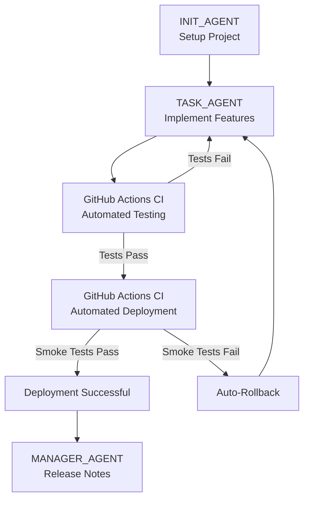
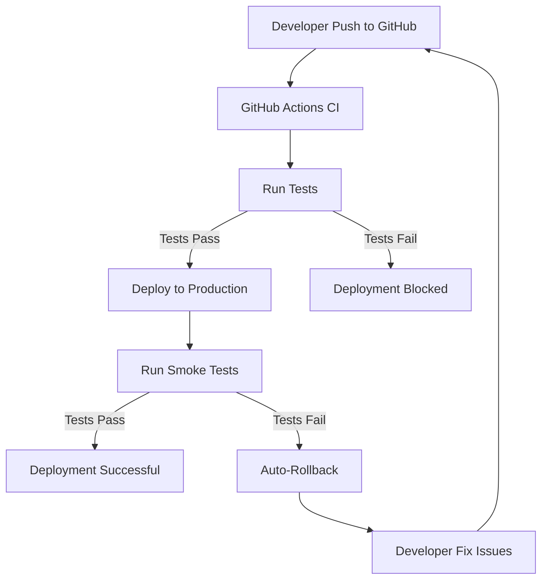

# AI-Driven Development for Everyone

Build complete applications using AI - no coding experience required!

---

## 📋 Table of Contents

**For Beginners:**
- [TLDR: Quick Start Guide](#tldr-quick-start-guide) - 5-minute overview
- [Glossary of Terms](#glossary-of-terms) - Important technical terms explained
- [Simple Workflow](#simple-workflow-non-coder-friendly) - Step-by-step guide
- [Tips for Non-Coders](#tips-for-non-coders) - Best practices
- [Common Questions](#common-questions) - FAQ

**For Experts:**
- [Advanced: Technical Architecture](#advanced-technical-architecture) - Deep dive
- [Reference Guides](#reference-guides) - Testing & Deployment

**Both:**
- [Resuming Work](#resuming-work-on-your-project) - Continue where you left off
- [Practical Tips](#practical-tips-from-practitioners) - Real-world advice
- [Getting Started Checklist](#getting-started-checklist) - Pre-flight checklist

**Quick Links:**
- 🚀 [Start New Project](#step-1-start-your-project) - Use INIT_AGENT
- 💻 [Implement Features](#step-2-let-ai-build-it-concurrent-workflow) - Use TASK_AGENT
- 🔧 [Manage Changes](#step-5-manage_changes) - Use MANAGER_AGENT

---

## TLDR: Quick Start Guide

```mermaid
graph TD
    A[Start Project<br/>Mention INIT_AGENT] --> B[AI Setup Project<br/>Create README, PRD, TDD, PROGRESS]
    B --> C[Implement Features<br/>Mention TASK_AGENT]
    C --> D[AI Builds Features<br/>In Parallel]
    D --> E[Test & Review<br/>Browser Testing]
    E --> F{Need Changes?}
    F -->|Yes| C
    F -->|No| G[Merge to Main]
    G --> H[GitHub Actions CI<br/>Automated Testing]
    H --> I{Tests Pass?}
    I -->|Yes| J[Deploy to Production<br/>Automated]
    I -->|No| K[Fix Issues]
    K --> G
    J --> L[Smoke Tests<br/>Automated]
    L --> M{Tests Pass?}
    M -->|Yes| N[Deployment Successful]
    M -->|No| O[Auto-Rollback]
    O --> P[MANAGER_AGENT<br/>Release Notes]
    P --> Q[Done! 🎉]
```



## What This Means

You can build real, working applications by simply **describing what you want** in plain language. The AI handles all the technical details.

---

## Simple Workflow (Non-Coder Friendly)

### Step 1: Start Your Project

Simply mention `@[workflow/INIT_AGENT.md]` and the AI will handle everything:

```
@[workflow/INIT_AGENT.md]
```

The AI will automatically:
1. Create/replace README.md with your project details
2. Create workflow/PRD.md with product requirements and design specifications
3. Create workflow/TDD.md with technical design document
4. Create workflow/ui-kit.html with UI design system
5. Create workflow/PROGRESS.md to track development progress
6. Setup design system (tailwind.config.js, DashboardLayout component)
7. Create database migrations
8. Run migrations
9. Initialize git and make first commit

You just need to describe your app and review the documentation!

**Example Chat Conversation:**

**What you say:**
```
Hai @[workflow/INIT_AGENT.md], let start new project.  I want to build ...
```

**AI responds:** I'll help you initialize a new Laju project. Let me start by asking about your project.

**What you say:**
```
I want to build a simple task management app where:
- Users can create projects with name and description
- Each project has tasks
- Tasks can be marked as done or not done
- Show all tasks on a dashboard
- Users can assign tasks to people
- Users can add comments to tasks
- Users can filter tasks by status
```

**AI responds:** Great! Let me create the project documentation for you.

[AI creates README.md, PRD.md, TDD.md, ui-kit.html, PROGRESS.md]

**AI responds:** I've created the documentation files. Please review them:
- README.md - Project overview, features, tech stack
- workflow/PRD.md - Requirements, design specifications
- workflow/TDD.md - Technical design document (architecture, database, API)
- workflow/ui-kit.html - UI design system and components
- workflow/PROGRESS.md - Development tracking template

Let me know if you'd like any changes before I proceed with setting up the design system and database.

**What you say:**
```
Looks good! Please proceed.
```

**AI responds:** Perfect! Now I'll setup the design system, create database migrations, run migrations, and initialize git.

[AI completes the setup]

**AI responds:** Project initialization complete! Your project is ready. You can now mention @[workflow/TASK_AGENT.md] to start building features.

**What you say:**
```
Hai @[workflow/TASK_AGENT.md], let start new feature
```

**AI responds:** Let me check PROGRESS.md to see what tasks we have...

[AI displays tasks from PROGRESS.md and starts building]
```

### Step 2: Let AI Build It (Concurrent Workflow)

**For daily development tasks, mention `@[workflow/TASK_AGENT.md]`**

After git init, your project is ready! The AI can now work on multiple features **simultaneously**:

The AI will:
1. Ask you clarifying questions (answer them in plain language)
2. Create all necessary files **in parallel** - controllers, pages, migrations, routes
3. Build the user interface for all features at once
4. Make everything work together
5. **Auto-save your progress** (you don't need to worry about git)

**Key benefit:** All phases happen concurrently - the AI doesn't wait for one feature to finish before starting the next. Everything gets built together!

**Test & Review During Development:**
As the AI builds each feature, you can:
- **Test** - Open `http://localhost:5555` and try out each feature as it's built
- **Review** - Check if the feature works as you described
- **Give feedback** - Tell the AI what to change: "The button should be blue" or "Add a confirmation dialog"

The AI will adjust based on your feedback immediately while continuing to build other features in parallel.

You just need to review and say "yes" or "make changes".

### Step 3: Test Your App

Open `http://localhost:5555` in your browser and try it out!

If something doesn't work right, just tell the AI:
```
The create project button doesn't work, please fix it
```

The AI will fix it and save the changes automatically.

### Step 4: Deployment

When all features are working as expected, deploy your app:

```
How do I deploy this app so others can use it?
```

**The AI will guide you through the deployment process:**

1. **Merge to main branch:**
   ```bash
   git checkout main
   git merge feature/your-feature
   git push origin main
   ```

2. **GitHub Actions runs automatically:**
   - Run tests (unit, integration, E2E)
   - Deploy ke production (hanya jika tests pass)
   - Run smoke tests
   - Auto-rollback jika fail

3. **Monitor deployment:**
   - Buka GitHub Actions tab
   - Lihat workflow progress

4. **Post-deployment verification:**
   ```bash
   ssh root@server
   pm2 status
   pm2 logs laju --lines 50
   curl http://localhost:5555
   ```

**Note:** Deployment is automated via GitHub Actions CI. You don't need to manually deploy - just merge to main and GitHub Actions handles the rest.

### Step 5: MANAGE_CHANGES

Untuk manage perubahan dan release notes:

```
Hai @workflow/MANAGER_AGENT.md, ada change request:
SOURCE: Client
TYPE: Feature Request
REQUEST: Tolong tambah fitur kirim notifikasi WhatsApp
```

MANAGER_AGENT akan:
- Analyze impact
- Update documentation (PRD, TDD, PROGRESS)
- Approve deployment
- Create release notes

**Code Review (Optional):**
```
Hai @workflow/MANAGER_AGENT.md, tolong code review:
- Code quality check
- Test coverage review
- Documentation verification
- Deployment readiness approval
```

**Note:** We use the Waterfall development method - all features are defined upfront in Step 1 and built together. If you discover you need additional features later, you'll need to start a new development cycle from Step 1.

---

## Resuming Work on Your Project

If you need to take a break and come back later, here's how to continue:

**Always mention `@[workflow/TASK_AGENT.md]` when resuming work**

### Check Your Progress First

Always start by checking `PROGRESS.md` to see what's been completed:

```
AI: "Let me check PROGRESS.md to see where we left off..."
```

The AI will read your progress and show you:
- What's already been built
- What's currently in progress
- What's still pending

### Continue Building

The AI will automatically continue with pending items from PROGRESS.md:

```
AI: "I see from PROGRESS.md that we have these pending items:
- User authentication
- Task creation form
- Dashboard with task list

Let's continue building these features."
```

The AI will:
1. Read PROGRESS.md to see pending items
2. Start building the pending features concurrently
3. Test and review as features are completed
4. Auto-save progress after each working feature

### Example: Resuming After a Break

**You:**
```
I'm back. Let's continue where we left off.
```

**AI:**
```
I checked PROGRESS.md. Here's our current status:

✅ Completed:
- Initial setup
- README.md created
- PRD.md created
- Design system configured
- Database migrations

🔄 In Progress:
- User authentication (login page)

⏳ Pending:
- User registration
- Task creation
- Dashboard

Let's continue with user authentication. I'll complete the login page and start on registration.
```

---

## Tips for Non-Coders

### Be Specific About Features

**Good:**
```
Users can create projects with a name and description
```

**Too Vague:**
```
Make a project management thing
```

### Describe in Business Terms, Not Technical

**Good:**
```
When a user creates a task, it should show up on their dashboard
```

**Too Technical:**
```
Create a task table with foreign key to users and render on dashboard
```

### Think About the User Experience

Describe what happens step by step:
```
1. User clicks "New Project" button
2. A form appears asking for project name and description
3. User fills in the form and clicks "Create"
4. The project is saved and appears in the project list
```

### Be Thorough in Your Description

With the Waterfall method, it's important to describe all features upfront:

**Good (Complete Description):**
```
I want a task management app where:
- Users can create projects with name and description
- Each project has tasks
- Tasks can be marked as done or not done
- Users can assign tasks to people
- Users can add comments to tasks
- Show all tasks on a dashboard
```

**Incomplete (Will Need Another Cycle):**
```
I want a task management app with projects and tasks.
```

**Tip:** Take time to think through all the features you need before starting. The AI will ask clarifying questions to help you be thorough.

---

## Common Questions

### Do I need to know any programming?

**No!** You just need to be able to:
- Describe what you want in plain language
- Use a computer
- Browse the web

### What if the AI makes a mistake?

Just tell it:
```
This doesn't work as expected. [Describe what's wrong]
```

The AI will fix it.

### Can I change my mind later?

Yes! Just tell the AI:
```
I want to change how the dashboard looks. Show tasks grouped by project instead of a list
```

### How do I deploy my app?

When you're happy with your app, ask the AI:
```
How do I deploy this app so others can use it?
```

The AI will guide you through the process:
1. Merge to main branch
2. GitHub Actions runs automatically
3. Tests run (unit, integration, E2E)
4. Deploy ke production (hanya jika tests pass)
5. Run smoke tests
6. Auto-rollback jika fail

### Apakah perlu mention TESTING_AGENT?

**Tidak perlu.** TESTING_AGENT berjalan otomatis via GitHub Actions CI setiap kali Anda push ke GitHub. Tests run otomatis (unit, integration, E2E).

### Apakah perlu mention DEPLOYMENT_AGENT?

**Tidak perlu.** DEPLOYMENT_AGENT berjalan otomatis via GitHub Actions CI saat Anda merge ke main branch. Deployment otomatis jalan jika tests pass.

### Bagaimana cara code review?

Code review ditangani oleh MANAGER_AGENT. Untuk code review:
```
Hai @workflow/MANAGER_AGENT.md, tolong code review:
- Code quality check
- Test coverage review
- Documentation verification
- Deployment readiness approval
```

MANAGER_AGENT akan:
- Review code quality
- Check test coverage (70%+)
- Verify documentation
- Approve deployment

### Apakah deployment otomatis?

**Ya, deployment otomatis via GitHub Actions CI.** Cukup merge ke main branch dan GitHub Actions akan:
- Run tests (unit, integration, E2E)
- Deploy ke production (hanya jika tests pass)
- Run smoke tests
- Auto-rollback jika fail

### Apakah ada auto-rollback?

**Ya, auto-rollback otomatis via GitHub Actions CI.** Jika smoke tests fail setelah deployment, GitHub Actions akan otomatis rollback ke versi sebelumnya.

### What if I don't understand something the AI says?

Ask the AI to explain:
```
I don't understand what you mean by [technical term]. Please explain in simple terms.
```

---

## Practical Tips from Practitioners

### Use Different AI Models for Different Phases

**Before Starting Your Project:**
- Use **Gemini 3 Pro** (via Gemini Web) for:
  - Creating complete PRD (Product Requirements Document)
  - Designing landing page
  - Creating design system and UI-kit
  - Gemini 3 Pro excels at visual design and comprehensive documentation

**During Development:**
- Use **GLM 4.7** or similar cost-effective AI models for:
  - Writing code and implementing features
  - Debugging and fixing issues
  - More affordable for extended development sessions

**Why This Approach?**
- Saves money - use expensive AI only for design/planning phase
- Better results - leverage each AI's strengths
- Faster development - design is ready before coding starts

### AGENTS.md & Workflow Configuration

The Laju framework uses a structured workflow system:

- **AGENTS.md** - Global rules and conventions (always applies)
- **workflow/INIT_AGENT.md** - Project initialization workflow (12 steps)
- **workflow/TASK_AGENT.md** - Feature implementation workflow
- **workflow/MANAGER_AGENT.md** - Change management and release notes
- **skills/testing-guide.md** - Testing reference (unit, integration, E2E)
- **skills/deployment-guide.md** - Deployment reference

### New Workflow Structure

**Active Agents (3):**
- INIT_AGENT - Setup project infrastructure
- TASK_AGENT - Implementasi fitur
- MANAGER_AGENT - Manajemen perubahan dan release notes

**Reference Guides (skills/):**
- testing-guide.md - Panduan menulis test
- deployment-guide.md - Panduan deployment ke production

**Automation (GitHub Actions CI):**
- Automated testing (unit, integration, E2E)
- Automated deployment (only if tests pass)
- Auto-rollback on failure

**Key Workflow Files:**
- `workflow/PROGRESS.md` - Track development progress
- `workflow/PRD.md` - Product requirements and design specifications
- `workflow/TDD.md` - Technical design document
- `workflow/ui-kit.html` - UI design system components

### Benefits of New Workflow

**Untuk Solo Developer:**
- ✅ Automated testing - Tests run otomatis, tidak perlu manual
- ✅ Automated deployment - Deploy otomatis, tidak perlu manual
- ✅ Auto-rollback - Otomatis rollback jika ada masalah
- ✅ Simplified workflow - Hanya 3 agents, bukan 5
- ✅ Industry-standard GitHub Flow - Best practice untuk solo developer
- ✅ Quality gates - Deployment hanya jika tests pass
- ✅ Less manual work - Banyak hal otomatis

**Untuk Code Quality:**
- ✅ Code review otomatis (opsional) - MANAGER_AGENT handle
- ✅ Test coverage tracking - GitHub Actions CI track coverage
- ✅ Smoke tests otomatis - Post-deployment verification
- ✅ Release notes otomatis - MANAGER_AGENT create

**Untuk Development Speed:**
- ✅ Less manual intervention - Banyak hal otomatis
- ✅ Faster feedback loop - Tests run otomatis setiap push
- ✅ Prevent broken deployments - Auto-rollback jika fail
- ✅ Focus on development - Tidak perlu khawatir deployment manual

### Workflow Flowchart



### Deployment Workflow



---

## Getting Started Checklist

- [ ] Have an idea for an app
- [ ] Install Node.js (if not already installed)
- [ ] Choose an AI assistant (Claude Code, Cursor, Windsurf, etc.)
- [ ] Create your project: `npx create-laju-app my-project`
- [ ] Describe ALL features you want (be thorough!)
- [ ] Review and approve documentation (README, PRD, TDD, ui-kit, PROGRESS)
- [ ] Setup GitHub Actions workflow (copy from github-workflow-sample/workflows/deploy.yml)
- [ ] Test it in your browser
- [ ] Merge to main branch (triggers GitHub Actions CI)
- [ ] GitHub Actions runs tests otomatis
- [ ] GitHub Actions deploys otomatis (hanya jika tests pass)
- [ ] MANAGER_AGENT creates release notes

---

## Advanced: When You Want More Control

As you get more comfortable, you can start learning the technical details. But you don't have to - the simple workflow works perfectly fine for building complete applications.

If you're curious, you can ask the AI:
```
Can you explain how the database works?
```
```
What files were created for the project feature?
```

The AI will teach you at your own pace.

---

## Summary

**To build an app with Laju + AI:**

1. Create project (1 command)
2. Set up project with AI (INIT_AGENT - describe ALL features upfront)
3. Let AI build everything concurrently (TASK_AGENT)
4. Test in browser
5. Merge ke main branch (triggers GitHub Actions CI)
6. GitHub Actions runs tests otomatis
7. GitHub Actions deploys otomatis (hanya jika tests pass)
8. MANAGER_AGENT creates release notes

**No coding required. Just describe thoroughly and let AI build it.**

**New Workflow:**
- 3 Active Agents (INIT, TASK, MANAGER)
- GitHub Actions CI (automated testing & deployment)
- Reference Guides (skills/testing-guide.md, skills/deployment-guide.md)
- Auto-rollback on failure

**Key Benefits:**
- Automated testing via GitHub Actions CI
- Automated deployment (only if tests pass)
- Auto-rollback on failure
- Simplified pre-deployment checklist
- Industry-standard GitHub Flow
- Cocok untuk solo developer

---

## Need Help?

If you get stuck, just ask the AI:
```
I'm having trouble with [describe the problem]. Can you help me fix it?
```

The AI is there to help you every step of the way.

Happy building! 🚀